# 🎓 Projet DevOps — Déploiement d'Open edX

> **Déploiement automatisé d'Open edX sur OpenStack** — Infrastructure as Code, conteneurisation et CI/CD, réalisé par une équipe DevOps de 3 personnes dans le cadre du stage DevOps RIF.


---

## 📑 Sommaire

1. [Aperçu du projet](#aperçu-du-projet)
2. [Périmètre](#périmètre)
3. [Stack technique](#stack-technique)
4. [Équipe](#équipe)
5. [Phases & Work Breakdown Structure (WBS)](#phases--work-breakdown-structure-wbs)
6. [Structure du dépôt](#structure-du-dépôt)
7. [Déploiement avec Ansible](#déploiement-avec-ansible)
8. [Workflow Git](#workflow-git)
9. [Jalons](#jalons)
10. [Risques clés](#risques-clés)
11. [Documentation complémentaire](#documentation-complémentaire)

---

## Aperçu du projet

Ce projet livre un **déploiement entièrement automatisé de la plateforme Open edX** sur une machine virtuelle OpenStack pré-provisionnée, dans le cadre d'un stage DevOps.

> *« Une usine n'installe jamais le toit avant les fondations. Le cahier des charges contient douze parties — mais ce ne sont pas douze réponses indépendantes : c'est une chaîne de montage unique, où chaque poste attend que le précédent ait terminé. »*

La couche d'infrastructure (OpenStack + Terraform + SSH) est **déjà provisionnée et figée**. Aucun work package (WP) de ce projet ne la modifie — c'est la fondation sur laquelle tout le reste se construit.

| Couche | État | Détail |
|---|---|---|
| OpenStack + Terraform | 🔒 Fermée | VM provisionnée, réseau et Security Group configurés |
| VM Ubuntu + Docker + Tutor + Open edX | 🚧 À construire | WP-01 → WP-05 (manual-first, puis automatisé) |
| GitHub + Ansible + CI/CD | 🚧 À construire | WP-06 → WP-08 (automatisation) |
| Tests · Architecture · Bonnes pratiques · Présentation | 🤝 Collaboratif | WP-09 → WP-12 (validation) |

> [!NOTE]
> Le plan de projet complet (affectation des tâches, dépendances, Gantt, jalons, risques) est disponible dans [`wbs.md`](wbs.md). Ce README en est le point d'entrée opérationnel ; le WBS en est la source de vérité.

---

## Périmètre

| Dans le périmètre ✅ | Hors périmètre ❌ |
|---|---|
| Préparation de la VM Ubuntu (mises à jour, dépendances, UFW, Fail2Ban) | Provisioning OpenStack (déjà fait via Terraform — **couche fermée**) |
| Installation & durcissement de Docker | Configuration réseau/SSH de base (déjà faite) |
| Installation & configuration de Tutor | Développement de thème/plugin Open edX personnalisé |
| Déploiement Open edX (LMS, Studio, MySQL, MongoDB, Redis, OpenSearch, Nginx) | Montée en charge multi-nœuds / Kubernetes |
| Comptes administrateurs & validation fonctionnelle | |
| Structure du dépôt GitHub (`terraform/`, `ansible/`, `.github/`, `scripts/`) | |
| Automatisation Ansible (rôles, inventaire, playbooks, idempotence) | |
| CI/CD GitHub Actions (déploiement sur `push`) | |
| Tests d'intégration, documentation d'architecture, bonnes pratiques, présentation finale | |

---

## Stack technique

```
OpenStack (VM) ──► Ubuntu 22.04 ──► Docker ──► Tutor ──► Open edX
        └── Terraform (fait)      └── Ansible + GitHub Actions (à construire)
```

| Couche | Technologie |
|---|---|
| Virtualisation | OpenStack (flavor `m1.small-custom`, image `Ubuntu-22.04`) |
| OS | Ubuntu 22.04 LTS |
| Conteneurisation | Docker Engine + Docker Compose |
| Déploiement applicatif | Tutor (CLI Open edX) |
| Plateforme | Open edX : LMS, Studio, MySQL, MongoDB, Redis, OpenSearch, Nginx |
| IaC / Config | Terraform (infra figée) + Ansible (WP-06/WP-07) |
| CI/CD | GitHub Actions (WP-08) |

> [!WARNING]
> **Dimensionnement de la VM.** La VM actuelle fournie est **2 vCPU / 6 Go RAM / 20 Go disque** (voir [`docs/journal.md`](docs/journal.md)). Le WBS recommande **8 Go RAM / 4 vCPU / 25 Go disque** pour faire tourner les 7–8 conteneurs Open edX de façon stable (le minimum Tutor est 4 Go/2 vCPU/8 Go, à réserver aux tests). Un manque de ressources provoque des OOM kills (risque **R3**) — ajouter du swap en palliatif et redimensionner via Terraform si nécessaire.

---

## Équipe

| Membre | Rôle | Domaine | Charge cible |
|---|---|---|---|
| 🟦 **Mariem** | Infrastructure Engineer | Préparation VM, Docker, sécurité système | ≈ 30 % |
| 🟩 **Taieb** | Platform Engineer | Tutor, déploiement Open edX, administration | ≈ 35 % |
| 🟨 **Adrian** | Automation Engineer | GitHub, Ansible, pipelines CI/CD | ≈ 35 % |
| 🤝 **Tous** | Partagé | Tests, architecture, bonnes pratiques, présentation | réparti équitablement |

> [!TIP]
> Stratégie d'allocation (issue du WBS) :
> 1. **Propriété du pipeline** — chaque membre possède un segment *contigu* (`VM → Docker` / `Tutor → Open edX → Admin` / `GitHub → Ansible → CI/CD`).
> 2. **Manual-first, then automate** — Mariem et Taieb installent à la main et **documentent chaque valeur** (fuseau, règles UFW, taille swap, config Tutor) ; Adrian les encode ensuite exactement dans Ansible. *« Ce que vous faites à la main aujourd'hui, vous devez pouvoir le refaire en code demain. »*
> 3. **Validation partagée** — la phase 4 (tests, architecture, bonnes pratiques, présentation) est explicitement collaborative.

---

## Phases & Work Breakdown Structure (WBS)

Le projet suit une **chaîne stricte** : on ne peut pas écrire un rôle Ansible fiable (WP-07) pour une installation jamais faite à la main, ni lancer Tutor (WP-03) sans Docker (WP-02), ni construire la CI/CD (WP-08) sans un playbook déjà opérationnel en mode non surveillé.

```mermaid
flowchart LR
    subgraph DONE["🔒 Couche fermée (faite)"]
        INFRA["OpenStack + Terraform<br/>VM provisionnée"]
    end
    subgraph P1["Phase 1 · Infrastructure — Mariem 🟦"]
        VM["01 · Préparation VM"]
        DOCKER["02 · Docker"]
    end
    subgraph P2["Phase 2 · Plateforme — Taieb 🟩"]
        TUTOR["03 · Tutor"]
        EDX["04 · Open edX"]
        ADMIN["05 · Comptes admin"]
    end
    subgraph P3["Phase 3 · Automatisation — Adrian 🟨"]
        GH["06 · Structure GitHub"]
        ANSIBLE["07 · Ansible"]
        CICD["08 · GitHub Actions CI/CD"]
    end
    subgraph P4["Phase 4 · Validation — Tous 🤝"]
        TESTS["09 · Tests"]
        ARCH["10 · Architecture"]
        BP["11 · Bonnes pratiques"]
        PRES["12 · Présentation"]
    end
    INFRA --> VM --> DOCKER --> TUTOR --> EDX --> ADMIN
    ADMIN --> GH --> ANSIBLE --> CICD --> TESTS
    TESTS --> ARCH --> BP --> PRES
    TESTS -. "corrections remontent en amont" .-> ANSIBLE

    classDef done fill:#1B1B18,color:#F6F4EE,stroke:#1B1B18
    classDef mariem fill:#D6E9F8,stroke:#0E7C9E,color:#1B1B18
    classDef taieb fill:#DFF2E1,stroke:#2E7D32,color:#1B1B18
    classDef adrian fill:#FFF3CD,stroke:#B8860B,color:#1B1B18
    classDef all fill:#F0E6F6,stroke:#6A1B9A,color:#1B1B18
    class INFRA done
    class VM,DOCKER mariem
    class TUTOR,EDX,ADMIN taieb
    class GH,ANSIBLE,CICD adrian
    class TESTS,ARCH,BP,PRES all
```



| ID | Work Package | Description courte | Propriétaire | Dépendances |
|---|---|---|---|---|
| **WP-01** | Préparation VM | Mises à jour, fuseau, dépendances, UFW (SSH **avant** enable), Fail2Ban, vérif. ressources | 🟦 Mariem | Terraform (fait) |
| **WP-02** | Docker | Install depuis dépôt officiel (GPG), durcissement, tests `hello-world` | 🟦 Mariem | WP-01 |
| **WP-03** | Tutor | Install Tutor (`pipx`/`uv`), config initiale, plugins | 🟩 Taieb | WP-02 |
| **WP-04** | Déploiement Open edX | Stack complète (LMS, Studio, MySQL, MongoDB, Redis, OpenSearch, Nginx) | 🟩 Taieb | WP-03 |
| **WP-05** | Comptes admin | Superuser LMS/Studio, config initiale, smoke tests | 🟩 Taieb | WP-04 |
| **WP-06** | Structure GitHub | `terraform/`, `ansible/`, `.github/`, `scripts/`, branches, README, `.gitignore` | 🟨 Adrian | Aucune (parallèle) |
| **WP-07** | Ansible | Inventaire, rôles, playbooks, idempotence (2e run = 0 changement) | 🟨 Adrian | WP-05, WP-06 + notes |
| **WP-08** | CI/CD GitHub Actions | Workflow sur `push`, secrets, déploiement automatique | 🟨 Adrian | WP-07 |
| **WP-09** | Tests d'intégration | Validation bout-en-bout (Docker→Tutor→LMS→Studio→CI) | 🤝 Tous (lead Mariem) | WP-08 |
| **WP-10** | Architecture finale | Diagrammes + flux entre tous les blocs | 🤝 Tous (lead Taieb) | WP-09 |
| **WP-11** | Bonnes pratiques | Revue IaC, secrets, idempotence, monitoring, logs, backups | 🤝 Tous (lead Adrian) | WP-10 |
| **WP-12** | Présentation finale | Slides, démo live, soutenance | 🤝 Tous | WP-11 |

> [!IMPORTANT]
> **WP-06 est le seul WP hors chemin critique** : Adrian le réalise en semaine 1, en parallèle de l'infra de Mariem, pour que le dépôt soit prêt dès le début des travaux Ansible.
> **Chemin critique :** `WP-01 → WP-02 → WP-03 → WP-04 → WP-05 → WP-07 → WP-08 → WP-09 → WP-12`.

---

## Structure du dépôt

```
.
├── ansible/                  # Automatisation (WP-07)
│   ├── ansible.cfg
│   ├── requirements.yml      # Collections Galaxy
│   ├── site.yml              # Playbook principal (WP-01 → WP-05)
│   ├── inventories/
│   │   └── production/       # VM OpenStack (IP via variables d'env)
│   │       ├── hosts.yml
│   │       └── group_vars/all.yml
│   └── roles/
│       ├── vm_prep/          # WP-01 : mises à jour, fuseau, dépendances
│       ├── security/         # WP-01 : UFW + Fail2Ban
│       ├── docker/           # WP-02 : Docker dépôt officiel, durci
│       ├── tutor/            # WP-03 : Tutor via pipx, configuration
│       └── openedx/          # WP-04/05 : plateforme + compte admin
├── .github/workflows/        # CI : lint (WP-06) ; déploiement à venir (WP-08)
│   └── lint.yml
├── scripts/
│   ├── deploy.sh             # Lance le playbook (charge .env)
│   └── check-idempotence.sh  # 2e run doit être changed=0 (risque R5)
├── terraform/                # Couche infra gelée (déjà provisionnée)
│   ├── main.tf
│   ├── variables.tf
│   ├── outputs.tf
│   ├── providers.tf
│   └── terraform.tfvars
├── docs/                     # Journal, architecture, stratégie de branches
│   ├── journal.md
│   ├── architecture.md
│   └── branching-strategy.md
├── wbs.md                    # Plan projet / WBS (source de vérité)
└── README.md                 # Ce fichier
```

---

## Déploiement avec Ansible

### Prérequis

1. `ansible-core` + collections : `ansible-galaxy collection install -r ansible/requirements.yml`
2. Un fichier `.env` à la racine (**jamais commité**, voir risque **R6**) :

   ```bash
   OPENEDX_VM_HOST=<ip-de-la-vm>
   OPENEDX_VM_USER=ubuntu
   # facultatif : OPENEDX_SSH_KEY=~/.ssh/openedx_stage_ed25519
   # pour WP-05 : OPENEDX_ADMIN_PASSWORD=<mot-de-passe-admin>
   ```

3. Accès SSH par clé à la VM (l'authentification par mot de passe est à proscrire).

### Commandes

```bash
./scripts/deploy.sh                       # déploiement complet
./scripts/deploy.sh --tags wp01           # seulement la préparation VM
./scripts/deploy.sh --check --diff        # simulation sans modification
./scripts/check-idempotence.sh            # validation Definition of Done (WP-07)
```

Le lancement complet d'Open edX (7–8 conteneurs) est désactivé par défaut :
`./scripts/deploy.sh -e openedx_launch=true` (à coordonner avec Taieb, WP-03/04).

> [!NOTE]
> L'**idempotence** est une exigence de Definition of Done : un second run du playbook doit rapporter **zéro changement**. `scripts/check-idempotence.sh` automatise cette vérification (risque **R5**).

---

## Workflow Git

Modèle *GitHub Flow* simple, adapté à une équipe de 3 personnes sur 5 semaines. Détail complet dans [`docs/branching-strategy.md`](docs/branching-strategy.md).

| Règle | Détail |
|---|---|
| `main` protégée | Pas de push direct ; PR uniquement, 1 revue approbative requise |
| Nommage des branches | `feature/<sujet>`, `fix/<sujet>`, `docs/<sujet>` |
| CI verte obligatoire | workflow `ansible-lint` au vert avant merge |
| PR de taille réduite | un work package (ou sous-tâche) par PR |
| Aucun secret dans git | `.env`, clés, mots de passe — jamais (risque **R6**) |

| Branche | WP | Propriétaire |
|---|---|---|
| `feature/ansible-skeleton` | WP-06/WP-07 | Adrian |
| `feature/cicd-pipeline` | WP-08 | Adrian |
| `docs/architecture` | WP-10 | Taieb |

---

## Jalons

| # | Jalon | Définition | Dépend de |
|---|---|---|---|
| **M1** | 🖥️ VM prête pour Docker | UFW active (22/80/443), aucune MAJ/reboot en attente, ressources vérifiées | WP-01, WP-02 |
| **M2** | 🎓 Open edX en ligne | LMS + Studio joignables via Nginx ; conteneurs sains ; admin connecté | WP-03…WP-05 |
| **M3** | 🤖 Automatisation complète | `git push` déclenche Ansible via GitHub Actions et redéploie sans surveillance | WP-06…WP-08 |
| **M4** | ✅ Validé & documenté | Tests d'intégration OK ; docs architecture + bonnes pratiques mergées | WP-09…WP-11 |
| **M5** | 🎤 Projet soutenu | Présentation + démo live livrées au jury | WP-12 |

---

## Risques clés

| # | Risque | Mitigation | Propriétaire |
|---|---|---|---|
| **R1** | 🔒 **Verrouillage UFW** — activer le pare-feu avant d'autoriser SSH coupe tout accès | Ordre strict (`ufw allow OpenSSH` **avant** `ufw enable`) ; revue WP-01 | Mariem |
| **R3** | 💾 **VM sous-dimensionnée** — OOM kills / disque plein | Vérifier `free -h`/`df -h` tôt ; swap en palliatif ; resize OpenStack via Terraform | Mariem / Taieb |
| **R5** | 🔁 **Playbooks non idempotents** — OK au 1er run, casse au suivant | Test d'idempotence obligatoire (2e run = 0 changement) avant WP-07 fini | Adrian |
| **R6** | 🔑 **Fuite de secrets** — clés/令牌/mots de passe commités | `.gitignore` dès le début ; secrets GitHub Actions uniquement ; revue WP-11 | Adrian |

> Voir la liste complète (R1…R9) et les hypothèses dans [`wbs.md`](wbs.md) → *Risks & Assumptions*.

---

## Documentation complémentaire

- 📋 [`wbs.md`](wbs.md) — plan de projet complet (WBS, dépendances, Gantt, jalons, risques)
- 🌿 [`docs/branching-strategy.md`](docs/branching-strategy.md) — stratégie de branches & règles CI
- 🏛️ [`docs/architecture.md`](docs/architecture.md) — architecture cible (OpenStack → Open edX)
- 📓 [`docs/journal.md`](docs/journal.md) — journal technique (connexion VM, MAJ, install Docker, incidents)

---

<div align="center">

**🎓 Projet DevOps Open edX** · Mariem 🟦 · Taieb 🟩 · Adrian 🟨

*"Ce que vous faites à la main aujourd'hui, vous devez pouvoir le refaire en code demain."*

</div>
