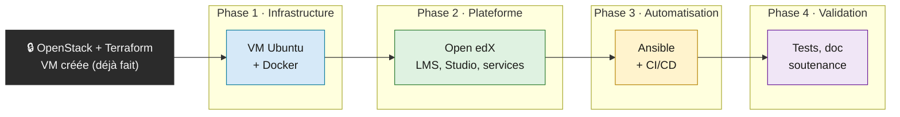

# Déploiement d'Open edX — Projet DevOps

Ce dépôt rassemble le travail d'une petite équipe de trois personnes, dans le cadre d'un stage DevOps, pour installer et automatiser la plateforme d'apprentissage **Open edX** sur un serveur OpenStack, puis déployer tout ça d'un simple `git push`.

En une phrase : on part d'une machine virtuelle vierge et on construit, couche par couche, une installation Open edX complète et reproductible en code.

## L'idée qui guide tout le projet

On ne pose pas le toit avant les fondations. Le cahier des charges se découpe en douze morceaux, mais ce ne sont pas douze tâches indépendantes : c'est une chaîne de montage où chaque étape attend que la précédente soit terminée.

Concrètement, voici le parcours d'une VM jusqu'à une plateforme en ligne :



Quelques règles simples expliquent pourquoi l'ordre compte :

- On n'écrit pas de rôle Ansible fiable pour une installation qu'on n'a jamais faite à la main.
- On ne lance pas Tutor sans Docker, et on ne construit pas la CI/CD sans un playbook déjà opérationnel tout seul.
- Ce que chacun fait à la main aujourd'hui, il doit pouvoir le refaire en code demain.

## L'équipe

Trois personnes, chacune responsable d'un segment de la chaîne :

- 🟦 **Mariem** — infrastructure : prépare la VM et installe Docker.
- 🟩 **Taieb** — plateforme : installe Tutor et déploie Open edX, crée les comptes admin.
- 🟨 **Adrian** — automatisation : structure le dépôt GitHub, écrit les rôles Ansible et la pipeline CI/CD.

La dernière phase (tests, architecture, bonnes pratiques, présentation) se fait à trois.

## Ce qu'il y a dans le dépôt

```
ansible/        Rôles et playbooks : préparation VM, sécurité, Docker, Tutor, Open edX
scripts/        deploy.sh (lancer le déploiement) et check-idempotence.sh (vérification)
terraform/      Configuration de la VM OpenStack — déjà provisionnée, ne pas y toucher
.github/        Workflow CI (ansible-lint) ; la pipeline de déploiement arrive avec le WP-08
docs/           journal technique, architecture cible, stratégie de branches
wbs.md          Le plan de projet complet (tâches, dépendances, jalons, risques)
```

La VM actuelle fournie par OpenStack est modeste (2 vCPU, 6 Go de RAM, 20 Go de disque). Faire tourner les 7–8 conteneurs Open edX dessus tient juste ; un manque de mémoire peut faire planter des services. On garde un œil dessus et on ajoute du swap si besoin.

## Déployer avec Ansible

Le déploiement se fait depuis votre poste, en SSH, vers la VM. Trois prérequis :

1. Installer les collections Ansible : `ansible-galaxy collection install -r ansible/requirements.yml`
2. Créer un fichier `.env` à la racine (jamais committé) avec l'adresse de la VM et votre clé SSH.
3. Avoir un accès SSH par clé à la VM.

```bash
./scripts/deploy.sh                  # déploiement complet
./scripts/deploy.sh --tags wp01      # seulement la préparation de la VM
./scripts/deploy.sh --check --diff   # simulation, sans rien modifier
./scripts/check-idempotence.sh       # relancer pour confirmer zéro changement
```

Le lancement complet d'Open edX (les conteneurs) reste volontairement désactivé par défaut ; on l'active avec `./scripts/deploy.sh -e openedx_launch=true`, en coordination avec Taieb.

> Un bon playbook Ansible doit être **idempotent** : le relancer ne change rien. C'est la règle d'or du projet, vérifiée automatiquement par `check-idempotence.sh`.

## Travailler ensemble

On utilise un GitHub Flow simple : `main` est protégée, chaque évolution passe par une branche `feature/*` et une PR relue par un collègue. La CI (`ansible-lint`) doit être verte avant de fusionner. Aucun secret (`.env`, clés, mots de passe) ne doit jamais être commité.

## Pour aller plus loin

- [wbs.md](wbs.md) — le plan de projet détaillé (les douze work packages, le chemin critique, les jalons et les risques).
- [docs/architecture.md](docs/architecture.md) — la pile logicielle cible, de OpenStack jusqu'à Open edX.
- [docs/branching-strategy.md](docs/branching-strategy.md) — le détail des branches et des règles CI.
- [docs/journal.md](docs/journal.md) — le journal technique (connexion à la VM, mises à jour, installation de Docker, incidents rencontrés).

---

*Projet DevOps Open edX — Mariem, Taieb, Adrian.*
