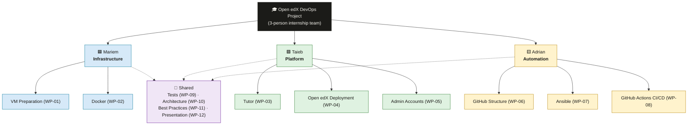
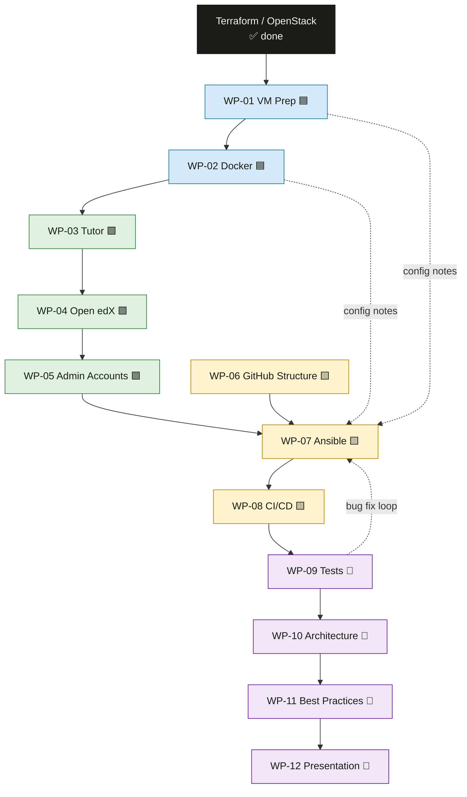
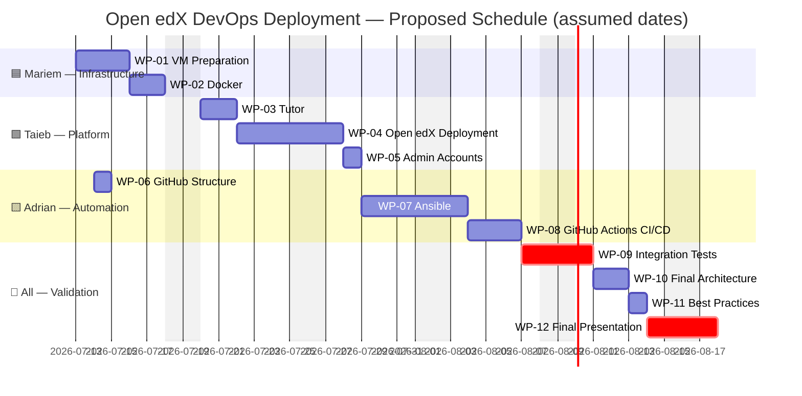

# 🎓 Open edX DevOps Deployment Project

> **Automated deployment of Open edX on OpenStack** — Infrastructure as Code, containerization, and CI/CD, delivered by a 3-person DevOps team.


---

## 📑 Table of Contents

1. [Project Overview](#-project-overview)
2. [Team Members](#-team-members)
3. [Work Allocation Strategy](#-work-allocation-strategy)
4. [Project Workflow](#-project-workflow)
5. [Work Breakdown Structure (WBS)](#-work-breakdown-structure-wbs)
6. [Team Responsibility Diagram](#-team-responsibility-diagram)
7. [Task Assignments](#-task-assignments)
8. [Task Dependency Graph](#-task-dependency-graph)
9. [Timeline & Gantt Chart](#-timeline--gantt-chart)
10. [Milestones](#-milestones)
11. [Deliverables](#-deliverables)
12. [Risks & Assumptions](#-risks--assumptions)
13. [Definition of Done](#-definition-of-done)

---

## 🚀 Project Overview

This project delivers a **fully automated deployment of the Open edX learning platform** on a pre-provisioned OpenStack virtual machine, as part of a DevOps internship.

The guiding principle from the project roadmap:

> *"A factory never installs the roof before the foundations. The brief contains twelve parts — but these are not twelve independent answers: it is a single assembly line, where each station waits for the previous one to finish."*

### Scope

| In Scope ✅ | Out of Scope ❌ |
|---|---|
| Ubuntu VM preparation (updates, dependencies, UFW, Fail2Ban) | OpenStack provisioning (already done via Terraform — **closed layer**) |
| Docker installation & hardening | SSH/network base setup (already done) |
| Tutor installation & configuration | Custom Open edX theme/plugin development |
| Open edX deployment (LMS, Studio, MySQL, MongoDB, Redis, OpenSearch, Nginx) | Multi-node / Kubernetes scaling |
| Admin accounts & functional validation | |
| GitHub repository structure (`terraform/`, `ansible/`, `.github/`, `scripts/`) | |
| Ansible automation (roles, inventory, playbooks, idempotence) | |
| GitHub Actions CI/CD (deploy on push) | |
| Integration testing, architecture documentation, best practices, final presentation | |

### Technology Stack

```
OpenStack (VM) ──► Ubuntu ──► Docker ──► Tutor ──► Open edX
        └── Terraform (done)      └── Ansible + GitHub Actions (to build)
```

> [!NOTE]
> The infrastructure layer (OpenStack + Terraform + SSH) is **already provisioned and frozen**. No work package in this plan modifies it — it is the ground everything else is built on.

---

## 👥 Team Members

| Member        | Role                    | Domain                                            | Workload Target |
| ------------- | ----------------------- | ------------------------------------------------- | --------------- |
| 🟦 **Mariem** | Infrastructure Engineer | VM preparation, Docker, system security           | ≈ 35 %          |
| 🟩 **Taieb**  | Platform Engineer       | Tutor, Open edX deployment, administration        | ≈ 35 %          |
| 🟨 **Adrian** | Automation Engineer     | GitHub, Ansible, CI/CD pipelines                  | ≈ 35 %          |
| 🤝 **All**    | Shared                  | Tests, architecture, best practices, presentation | shared equally  |

> [!TIP]
> The workload split (30/35/35) comes directly from the WBS document and reflects task **complexity**, not just task count: platform deployment and automation carry more technical risk than base infrastructure, which is partially guided by the course material (EDX·01 is fully documented).

---

## 🧭 Work Allocation Strategy

The allocation follows three rules derived from the WBS and course roadmap:

1. **Pipeline ownership** — each member owns a *contiguous* segment of the deployment pipeline (`VM → Docker` / `Tutor → Open edX → Admin` / `GitHub → Ansible → CI/CD`), minimizing handoffs and context switching.
2. **Manual-first, then automate** — Mariem and Taieb perform the manual installation and **document every value** (timezone, UFW rules, swap size, Tutor config). Adrian then encodes those exact values into Ansible. *"What you do by hand today, you must be able to redo in code tomorrow."*
3. **Shared validation** — the final phase (tests, architecture, best practices, presentation) is explicitly collaborative in the WBS and is the only phase where tasks are co-owned.

---

## 🔄 Project Workflow

```mermaid
flowchart LR
    subgraph DONE["🔒 Closed Layer (done)"]
        INFRA["OpenStack + Terraform<br/>VM provisioned"]
    end

    subgraph P1["Phase 1 · Infrastructure — Mariem 🟦"]
        VM["01 · VM Preparation"]
        DOCKER["02 · Docker"]
    end

    subgraph P2["Phase 2 · Platform — Taieb 🟩"]
        TUTOR["03 · Tutor"]
        EDX["04 · Open edX Deployment"]
        ADMIN["05 · Admin Accounts"]
    end

    subgraph P3["Phase 3 · Automation — Adrian 🟨"]
        GH["06 · GitHub Structure"]
        ANSIBLE["07 · Ansible"]
        CICD["08 · GitHub Actions CI/CD"]
    end

    subgraph P4["Phase 4 · Validation — All 🤝"]
        TESTS["09 · Tests"]
        ARCH["10 · Architecture"]
        BP["11 · Best Practices"]
        PRES["12 · Presentation"]
    end

    INFRA --> VM --> DOCKER --> TUTOR --> EDX --> ADMIN
    ADMIN --> GH --> ANSIBLE --> CICD --> TESTS
    TESTS --> ARCH --> BP --> PRES
    TESTS -. "bug fixes loop back upstream" .-> ANSIBLE

    classDef done fill:#1B1B18,color:#F6F4EE,stroke:#1B1B18
    classDef mariem fill:#D6E9F8,stroke:#0E7C9E,color:#1B1B18
    classDef taieb fill:#DFF2E1,stroke:#2E7D32,color:#1B1B18
    classDef adrian fill:#FFF3CD,stroke:#B8860B,color:#1B1B18
    classDef all fill:#F0E6F6,stroke:#6A1B9A,color:#1B1B18

    class INFRA done
    class VM,DOCKER mariem
    class TUTOR,EDX,ADMIN taieb
    class GH,ANSIBLE,CICD adrian
    class TESTS,ARCH,BP,PRES all
```



> [!IMPORTANT]
> The order is **strict, not arbitrary**: you cannot write a reliable Ansible role (07) for an installation you have never done by hand; you cannot run Tutor (03) without Docker (02); you cannot build CI/CD (08) without a playbook that already works unattended.

---

## 🗂️ Work Breakdown Structure (WBS)

```mermaid
flowchart TD
    ROOT["🎓 Open edX DevOps Project"]

    ROOT --> WBS1["1. Infrastructure 🟦<br/><i>Mariem</i>"]
    ROOT --> WBS2["2. Platform 🟩<br/><i>Taieb</i>"]
    ROOT --> WBS3["3. Automation 🟨<br/><i>Adrian</i>"]
    ROOT --> WBS4["4. Validation 🤝<br/><i>All</i>"]

    WBS1 --> T11["1.1 Prepare Ubuntu VM<br/>updates · deps · UFW · Fail2Ban"]
    WBS1 --> T12["1.2 Install Docker<br/>official repo · security · tests"]
    WBS1 --> T13["1.3 Verify environment<br/>RAM · disk · firewall layers"]

    WBS2 --> T21["2.1 Install Tutor<br/>config · plugins"]
    WBS2 --> T22["2.2 Deploy Open edX<br/>LMS · Studio · MySQL · MongoDB<br/>Redis · OpenSearch · Nginx"]
    WBS2 --> T23["2.3 Configure LMS / Studio"]
    WBS2 --> T24["2.4 Create admin accounts"]

    WBS3 --> T31["3.1 GitHub structure<br/>repo · branches · README · .gitignore"]
    WBS3 --> T32["3.2 Ansible<br/>inventory · roles · playbooks"]
    WBS3 --> T33["3.3 GitHub Actions<br/>workflow · secrets"]
    WBS3 --> T34["3.4 Automatic deployment"]

    WBS4 --> T41["4.1 Integration tests"]
    WBS4 --> T42["4.2 Architecture & documentation"]
    WBS4 --> T43["4.3 Final presentation"]

    classDef root fill:#1B1B18,color:#F6F4EE,stroke:#1B1B18
    classDef mariem fill:#D6E9F8,stroke:#0E7C9E,color:#1B1B18
    classDef taieb fill:#DFF2E1,stroke:#2E7D32,color:#1B1B18
    classDef adrian fill:#FFF3CD,stroke:#B8860B,color:#1B1B18
    classDef all fill:#F0E6F6,stroke:#6A1B9A,color:#1B1B18

    class ROOT root
    class WBS1,T11,T12,T13 mariem
    class WBS2,T21,T22,T23,T24 taieb
    class WBS3,T31,T32,T33,T34 adrian
    class WBS4,T41,T42,T43 all
```



---

## 🏛️ Team Responsibility Diagram



---

## 📋 Task Assignments

### Phase 1 — Infrastructure 🟦 (Owner: **Mariem**)

| ID | Task | Description | Deliverables | Dependencies | Est. Effort | Status |
|---|---|---|---|---|---|---|
| **WP-01** | VM Preparation | System updates (`apt update/upgrade`), timezone & locale, base dependencies (`curl`, `git`, `jq`, `python3`, `pipx`), UFW firewall (SSH **before** enable; 22/80/443), Fail2Ban, RAM/disk/swap verification, OpenStack Security Group cross-check | Hardened, up-to-date VM; documented config values (timezone, UFW rules, swap size) for later Ansible encoding; validation checklist passed | Terraform-provisioned VM (done) | ~3 days | 🔲 Not Started |
| **WP-02** | Docker | Install Docker from official repository (GPG-verified), post-install security hardening, non-root usage, verification tests (`docker run hello-world`) | Working, secured Docker Engine; installation notes for Ansible role | WP-01 | ~2 days | 🔲 Not Started |

### Phase 2 — Platform 🟩 (Owner: **Taieb**)

| ID | Task | Description | Deliverables | Dependencies | Est. Effort | Status |
|---|---|---|---|---|---|---|
| **WP-03** | Tutor | Install Tutor (isolated via `pipx`/`uv`), initial configuration, required plugins | Configured Tutor CLI; documented `config.yml` values | WP-02 | ~2 days | 🔲 Not Started |
| **WP-04** | Open edX Deployment | Deploy full stack: LMS, Studio, MySQL, MongoDB, Redis, OpenSearch, Nginx (7–8 containers) | Running Open edX platform reachable on ports 80/443 | WP-03 | ~4 days | 🔲 Not Started |
| **WP-05** | Admin Accounts | Create superuser/admin accounts, LMS + Studio access, initial platform configuration, functional smoke tests | Working admin access to LMS & Studio; documented credentials procedure (no secrets in repo) | WP-04 | ~1 day | 🔲 Not Started |

### Phase 3 — Automation 🟨 (Owner: **Adrian**)

| ID | Task | Description | Deliverables | Dependencies | Est. Effort | Status |
|---|---|---|---|---|---|---|
| **WP-06** | GitHub Structure | Professional repository layout: `terraform/`, `ansible/`, `.github/`, `scripts/`; branching strategy; README; `.gitignore` | Versioned repository with agreed structure and branch protection | None (can start early; content lands after WP-05) | ~1 day | 🔲 Not Started |
| **WP-07** | Ansible | Inventory, roles, playbooks, variables encoding **exactly** what Mariem & Taieb did by hand (WP-01…WP-05); idempotence verified (2nd run = zero changes) | Idempotent playbooks reproducing the full setup unattended | WP-05, WP-06 + config notes from Mariem & Taieb | ~4 days | 🔲 Not Started |
| **WP-08** | GitHub Actions CI/CD | Workflow triggered on push, secrets management (SSH keys, tokens), automatic deployment replaying Ansible | Green pipeline: `git push` → automated deployment to the VM | WP-07 | ~3 days | 🔲 Not Started |

### Phase 4 — Validation 🤝 (Owner: **All** — collaboration explicitly required by the WBS)

| ID | Task | Description | Deliverables | Dependencies | Est. Effort | Lead | Status |
|---|---|---|---|---|---|---|---|
| **WP-09** | Integration Tests | Verify Docker, Tutor, LMS, Studio, and the CI/CD pipeline actually work end-to-end — *"not just 'it compiles'"*; loop fixes back upstream | Test report; fixed regressions | WP-08 | ~2 days | Mariem | 🔲 Not Started |
| **WP-10** | Final Architecture | Complete architecture diagram, logical architecture, data/deployment flows between all blocks | Architecture document + diagrams in repo | WP-09 | ~1.5 days | Taieb | 🔲 Not Started |
| **WP-11** | Best Practices | IaC review, secrets handling, idempotence audit, monitoring, logs, backups | Best-practices document; hardening applied | WP-10 | ~1.5 days | Adrian | 🔲 Not Started |
| **WP-12** | Final Presentation | Slides, live demonstration, defense before the jury | Slide deck + rehearsed demo | WP-11 | ~2 days | All (equal) | 🔲 Not Started |

> [!NOTE]
> In Phase 4, a **lead** is named per task to guarantee accountability, but effort is shared equally — as required by the WBS (`Resp.: Tous/All`). Every WP-01…WP-08 task has exactly **one** owner.

### Workload Summary

| Member | Owned Tasks | Solo Effort | + Shared (÷3) | Total | Target |
|---|---|---|---|---|---|
| 🟦 Mariem | WP-01, WP-02 | ~5 days | ~2.3 days | **~7.3 days (≈30 %)** | 30 % ✅ |
| 🟩 Taieb | WP-03, WP-04, WP-05 | ~7 days | ~2.3 days | **~9.3 days (≈35 %)** | 35 % ✅ |
| 🟨 Adrian | WP-06, WP-07, WP-08 | ~8 days | ~2.3 days | **~10.3 days (≈35 %)** | 35 % ✅ |

---

## 🔗 Task Dependency Graph



**Critical path:** `WP-01 → WP-02 → WP-03 → WP-04 → WP-05 → WP-07 → WP-08 → WP-09 → WP-12`

> [!TIP]
> **WP-06 (GitHub Structure) is the only task off the critical path** — Adrian should complete it in Week 1, in parallel with Mariem's infrastructure work, so the repository is ready the moment Ansible work begins.

---

## 📅 Timeline & Gantt Chart

> [!WARNING]
> The source documents (course sheets + WBS PDFs) define **task order and ownership but no calendar dates or durations**. The schedule below is a planning proposal based on the assumptions listed in [Risks & Assumptions](#-risks--assumptions): a ~5-week internship window starting **Monday, July 13, 2026**, with effort estimates derived from task complexity.



### Weekly View

| Week               | Focus                                                             | Active Members        |
| ------------------ | ----------------------------------------------------------------- | --------------------- |
| **W1** (Jul 13–17) | VM preparation, Docker install · GitHub repo skeleton in parallel | Mariem 🟦 · Adrian 🟨 |
| **W2** (Jul 20–24) | Tutor + Open edX deployment                                       | Taieb 🟩              |
| **W3** (Jul 27–31) | Admin accounts · Ansible roles & playbooks                        | Taieb 🟩 · Adrian 🟨  |
| **W4** (Aug 3–7)   | CI/CD pipeline · integration tests begin                          | Adrian 🟨 · All 🤝    |
| **W5** (Aug 10–14) | Architecture, best practices, presentation & defense              | All 🤝                |

---

## 🏁 Milestones

| # | Milestone | Definition | Target (assumed) | Depends on |
|---|---|---|---|---|
| **M1** | 🖥️ VM Ready for Docker | UFW active (22/80/443), no pending updates/reboot, resources verified (target 8 GB RAM / 4 CPU / 25 GB disk) | End of W1 | WP-01, WP-02 |
| **M2** | 🎓 Open edX Live | LMS + Studio reachable via Nginx; all 7–8 containers healthy; admin can log in | End of W2/early W3 | WP-03…WP-05 |
| **M3** | 🤖 Full Automation | `git push` triggers Ansible via GitHub Actions and redeploys unattended; playbooks idempotent | End of W4 | WP-06…WP-08 |
| **M4** | ✅ Validated & Documented | Integration tests pass; architecture + best-practices docs merged | Mid W5 | WP-09…WP-11 |
| **M5** | 🎤 Project Defended | Presentation and live demo delivered to the jury | End of W5 | WP-12 |

---

## 📦 Deliverables

| Deliverable | Produced by | Work Package | Format |
|---|---|---|---|
| Hardened Ubuntu VM + documented config values | Mariem 🟦 | WP-01 | Live system + notes |
| Secured Docker Engine | Mariem 🟦 | WP-02 | Live system + notes |
| Configured Tutor installation | Taieb 🟩 | WP-03 | Live system + `config.yml` notes |
| Running Open edX platform (LMS, Studio + services) | Taieb 🟩 | WP-04 | Live system |
| Admin accounts + functional access | Taieb 🟩 | WP-05 | Live system + procedure doc |
| GitHub repository (`terraform/`, `ansible/`, `.github/`, `scripts/`, README, `.gitignore`) | Adrian 🟨 | WP-06 | Git repository |
| Ansible inventory, roles & idempotent playbooks | Adrian 🟨 | WP-07 | Code in `ansible/` |
| CI/CD workflow with secrets management | Adrian 🟨 | WP-08 | Code in `.github/workflows/` |
| Integration test report | All 🤝 | WP-09 | Markdown report |
| Final architecture diagrams & flows | All 🤝 | WP-10 | Docs + diagrams |
| Best-practices document (IaC, secrets, monitoring, logs, backups) | All 🤝 | WP-11 | Markdown doc |
| Slide deck + live demonstration | All 🤝 | WP-12 | Slides + demo |

---

## ⚠️ Risks & Assumptions

### Assumptions

> [!NOTE]
> The following assumptions were made because the source documents specify **order, ownership, and workload ratios (30/35/35) but no dates or hour-level estimates**:

1. 📆 **Timeline** — a ~5-week window starting July 13, 2026 (working days only), consistent with the internship context dated July 11, 2026. All Gantt dates are proposals, not commitments.
2. ⏱️ **Effort estimates** — derived from task complexity and the WBS workload ratios; they must be re-validated by the team at kickoff.
3. 🖥️ **VM sizing** — the OpenStack flavor meets or can be resized to the recommended 8 GB RAM / 4 CPU / 25 GB disk (Tutor's 4 GB/2 CPU/8 GB is a bare minimum for testing only).
4. 🔑 **Access** — all three members have SSH + sudo access to the VM and write access to the GitHub repository.
5. 🌍 **Consistency** — the team standardizes one Ubuntu version and one timezone (Europe/Paris per course sheet EDX·01), otherwise Ansible behaves differently depending on who deploys.

### Risks

| # | Risk | Likelihood | Impact | Mitigation | Owner |
|---|---|---|---|---|---|
| R1 | 🔒 **UFW lockout** — enabling the firewall before allowing SSH cuts all access; only recovery is the OpenStack Horizon console | Medium | 🔴 High | Strict command order (`ufw allow OpenSSH` **before** `ufw enable`); peer-review of WP-01 checklist | Mariem |
| R2 | 🧱 **Double firewall confusion** — UFW open but OpenStack Security Group closed (or vice-versa); traffic blocked before reaching the VM | Medium | 🟠 Medium | Verify **both** layers (UFW + Security Group) for 22/80/443 during WP-01 | Mariem |
| R3 | 💾 **Under-sized VM** — 7–8 concurrent containers cause OOM kills or disk exhaustion | Medium | 🔴 High | Verify `free -h` / `df -h` early; add swap as stopgap; resize OpenStack flavor via Terraform if truly undersized | Mariem / Taieb |
| R4 | 🔗 **Critical-path slippage** — almost every task is sequential; any delay shifts everything downstream | High | 🟠 Medium | WP-06 done in parallel in W1; daily syncs; Taieb prepares Tutor study while WP-02 finishes | All |
| R5 | 🔁 **Non-idempotent playbooks** — Ansible works on first run but breaks or drifts on re-run | Medium | 🟠 Medium | Idempotence test mandatory (second run must report zero changes) before WP-07 is marked done | Adrian |
| R6 | 🔑 **Secret leakage** — SSH keys, tokens, or admin passwords committed to the repo | Low | 🔴 High | `.gitignore` from day one (WP-06); GitHub Actions secrets only; review in WP-11 | Adrian |
| R7 | ⏳ **CI/CD delay misdiagnosed** — the natural lag between `git push` and live deployment is mistaken for a failure | Low | 🟢 Low | Documented in the pipeline README: *the delay is normal, not a bug* | Adrian |
| R8 | 🕐 **Kernel update pending reboot** — changes are real but deferred; system behaves inconsistently until restarted | Medium | 🟢 Low | Check `/var/run/reboot-required` after every upgrade; reboot inside a `tmux` session | Mariem |
| R9 | 📝 **Undocumented manual steps** — hand-made config (timezone, UFW rules, swap) not recorded, making WP-07 automation guesswork | Medium | 🟠 Medium | Traceability rule from EDX·01: every manual value is noted and handed to Adrian | Mariem / Taieb |

---

## ✅ Definition of Done

A work package is **Done** only when:

- [ ] Its deliverable(s) exist and match the description above
- [ ] The expected-results checklist from the corresponding course sheet passes
- [ ] Any manual configuration values are documented for Ansible (WP-01…WP-05)
- [ ] Automation tasks pass an idempotence re-run with zero changes (WP-07, WP-08)
- [ ] Another team member has reviewed the work
- [ ] The status is updated in this README

---

<div align="center">

**🎓 Open edX DevOps Deployment** · Mariem 🟦 · Taieb 🟩 · Adrian 🟨

*"What you do by hand today, you must be able to redo in code tomorrow."*

</div>
